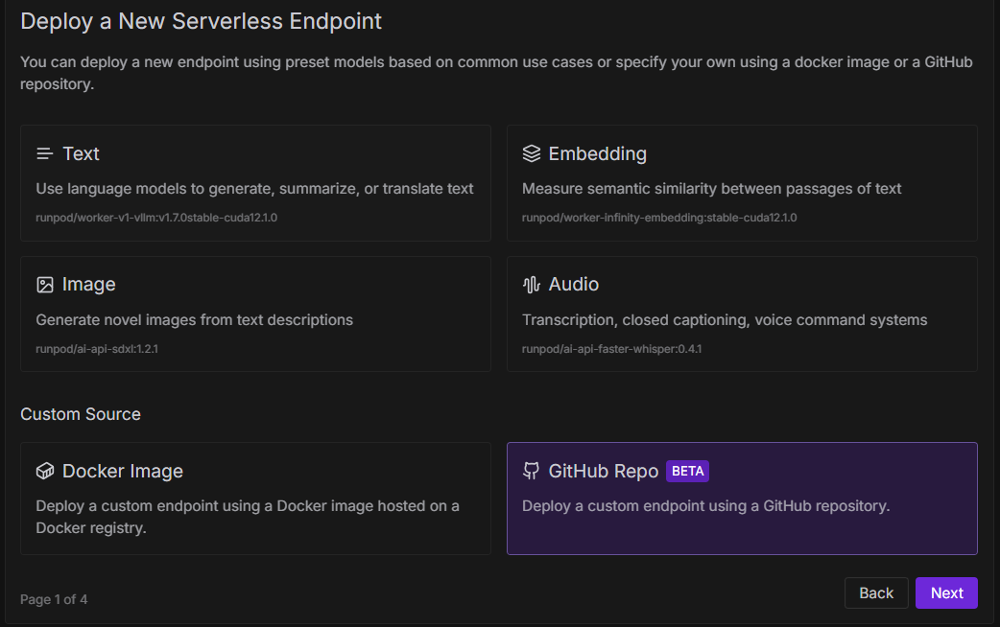
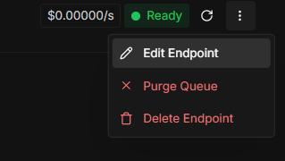
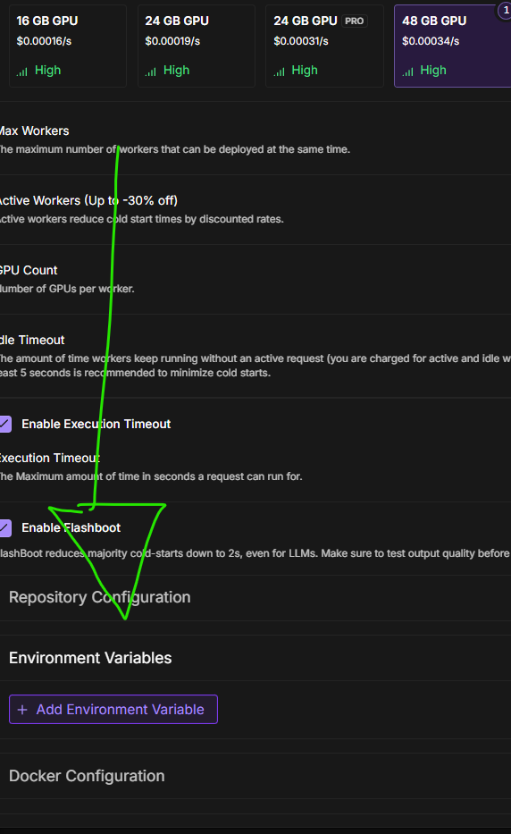
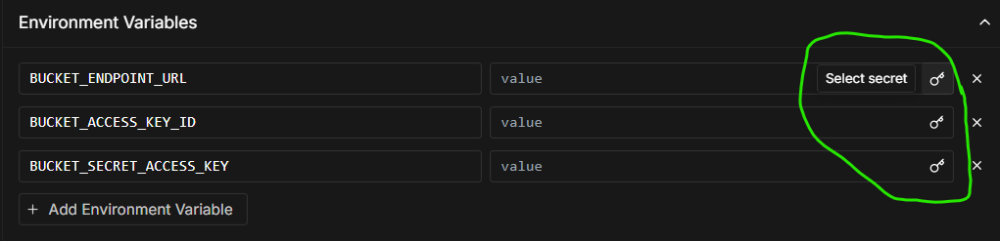

<div align="center">

# Flux worker
</div>


[](https://www.runpod.io/console/hub/UnSparkAI/worker-flux_schnell)
## **Inputs Guide:**
> [!IMPORTANT]
> Input schema below
## Input Schema Documentation

The model accepts the following parameters:

| Parameter | Type | Required | Default | Constraints | Description |
|-----------|------|----------|---------|------------|-------------|
| `prompt` | string | Yes | - | - | Text description of the image you want to generate |
| `width` | integer | No | 1024 | - | Width of the output image in pixels |
| `height` | integer | No | 1024 | - | Height of the output image in pixels |
| `num_outputs` | integer | No | 1 | 1-9 | Number of images to generate in a single request |
| `num_inference_steps` | integer | No | 50 | 1-199 | Number of denoising steps (more steps = higher quality but slower generation) |
| `guidance_scale` | float | No | 7.5 | 0-20 | How closely the model follows the prompt (higher values = more faithful to prompt but potentially less creative) |
| `seed` | integer | No | Random | - | Random seed for reproducible generation. Same seed + same parameters = same image |

### Example Input:
```json
{
  "input": {
    "prompt": "A serene mountain landscape at sunset with a lake reflecting the sky",
    "width": 1024,
    "height": 1024,
    "num_outputs": 1,
    "num_inference_steps": 50,
    "guidance_scale": 7.5,
    "seed": 42
  }
}
```
### Set Up:
1. **Create Serverless Endpoint**

Well, for me i can use github repo mode. but not sure if others can.

if not possible to use this, then you'll need to build, upload the docker image to a registry. then create template 
  in RunPod.
---
2. **Environment Variables**
Because the result image's will be uploaded into a s3 compatible storge bucket, we need to set something like this.
```bash
# S3 Bucket
BUCKET_ENDPOINT_URL =  # S3 bucket endpoint url
BUCKET_ACCESS_KEY_ID =  # S3 bucket access key id
BUCKET_SECRET_ACCESS_KEY =  # S3 bucket secret access key
```

> [!NOTE]
> Some screenshots to help:



> [!NOTE]  
> **You can use secrets too!**

---
